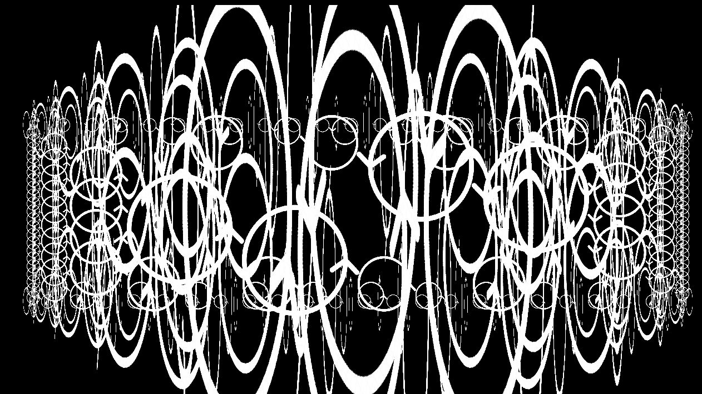
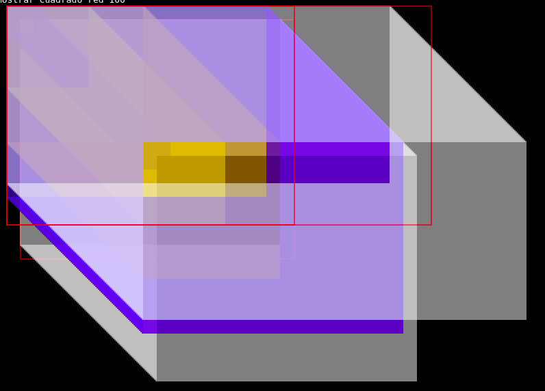
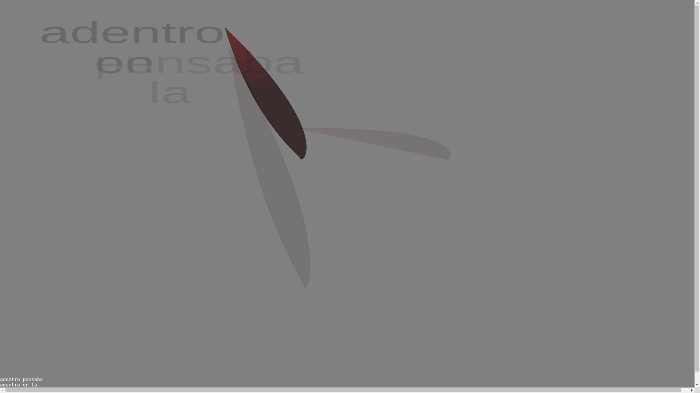
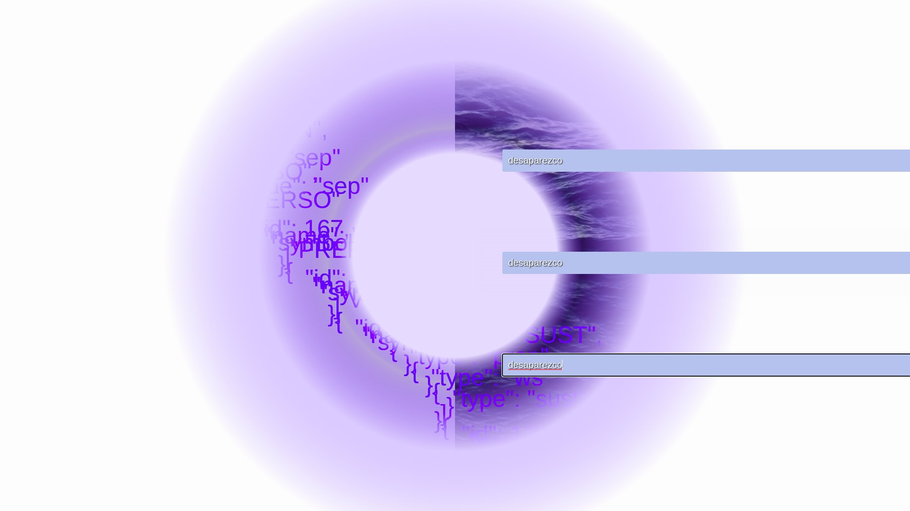

Curso Construcción de sentidos en el arte computacional: composición de lenguajes creativos
==========

Karen Palacio.

Para WIP arte digital.
2022.

* [Reflexiones Pre-curso](https://karen-pal.github.io/pre_curso)
* [Página del curso en WIP](https://wipartedigital.com/2022/02/la-construccion-de-sentidos-en-el-arte-computacional/)

# Estructura de este repositorio

Cada clase tiene una carpeta correspondiente, donde pueden encontrar ejemplos de programas a ejecutar, páginas con contenido y demostraciones paso a paso de desarrollos varios.

# Instrucciones para correr

En general se van a encontrar con distintos archivos html y js. Abrir el archivo html en un navegador. Esto se puede hacer arrastrando el archivo directamente desde el explorador de archivos hacia la ventana del navegador.

# Instrucciones para modificar

Para modificar el comportamiento de un programa, hay que modificar el texto del cuerpo del archivo html o javascript correspondiente. Esto se puede hacer abriendo el archivo en un editor de texto cualquiera. Te recomiendo [VS Code](https://code.visualstudio.com/), un editor de texto especializado en escribir programas, y que es bastante usado. Me vas a ver que yo uso vim para las clases, pero no es importante/necesario usar este editor.

# Lista de demos online
- [Lenguaje simple: implementación naive de un compilador de un lenguaje para dibujado](https://karen-pal.github.io/curso_nov_construccion_sentidos/lenguajes/indexDraw.html)

- [Cortar piel: exploracion poetica a partir del lenguaje simple](https://karen-pal.github.io/curso_nov_construccion_sentidos/lenguajes/cortarPiel/indexDraw.html)

- [Lenguaje de programación Senryu : nearleyjs con semántica, para la interacción con animaciones.](https://karen-pal.github.io/curso_nov_construccion_sentidos/semantica/desaparezco.html)

## Otros links ùtiles
### Sonoros
- [Paso a paso: desde importar ToneJS hasta usar filtros](https://karen-pal.github.io/curso_construcci-n_sentidos/clase3_texto-sonido/paso_a_paso/)
- [Dibujo+síntesis de sonido con ToneJS](https://karen-pal.github.io/curso_construcci-n_sentidos/clase4_texto-sonido-imagen/sorpr.html)

### Dibujo con canvas
- [Flor simple parametrizada](https://karen-pal.github.io/curso_construcci-n_sentidos/clase5_interconexiones/flor_simple.html)
- [Flor parametrizada + animada](https://karen-pal.github.io/curso_construcci-n_sentidos/clase5_interconexiones/flor.html)
- [Acuarela: dibujo+sintesis de sonido con ToneJS](https://karen-pal.github.io/curso_construcci-n_sentidos/clase5_interconexiones/acuarela.html)
### webcam
- [Acceso básico a webcam](https://karen-pal.github.io/curso_construcci-n_sentidos/clase5_interconexiones/webcam2.html)
- [Ejemplo de uso de webcam para netart](https://karen-pal.github.io/curso_construcci-n_sentidos/clase5_interconexiones/webcam.html)
### audio
- [Uso de meyda para dibujo audiorreactivo](https://karen-pal.github.io/curso_construcci-n_sentidos/clase5_interconexiones/meyda_audiorreactivo.html)
- [Uso básico de la API nativa de chrome de reconocimiento de habla automático](https://karen-pal.github.io/curso_construcci-n_sentidos/clase5_interconexiones/recognition.html)
- [Automatizar uso de la API de reconocimiento de habla](https://karen-pal.github.io/curso_construcci-n_sentidos/clase5_interconexiones/recognition_automatica.html)
- [Sistema para dibujar guiado con la voz: reconocimiento de habla automático usando API nativa de chrome](https://karen-pal.github.io/curso_construcci-n_sentidos/clase5_interconexiones/recognition_draw.html)

